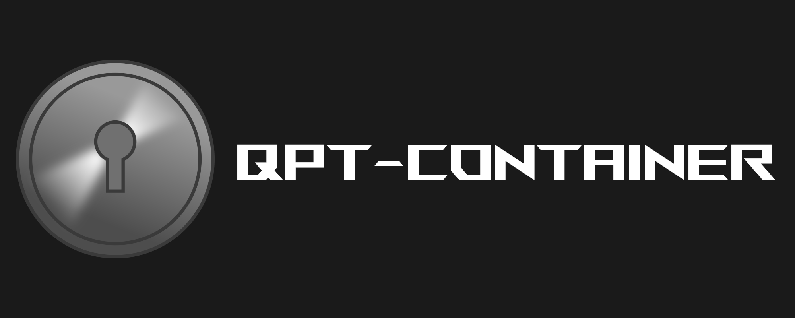

  

## Description and use

This is a desktop app for encrypting and storage your data in a safe way.
For obtain this the app manage a virtual disk where contains the files, in the app you can:

- Create files and folders
- Export and import the files
- Preview the files
- Remove folders and files

The app is very friendly and easy to use, you can create the disks you need and manage at the same time. And is completely secure because all the disk is locked with a password, and all the data will be store locally in your computer and not in the cloud or something like this.

> **Important**
>
> You must load the disk you want in the dropdown menu, for view and edit their content

## Executables

You can download the zip of the program for [windows](https://github.com/Guillex387/qpt-container/releases/download/v1.1.0/setup-v1.1.0.exe) and [linux](https://github.com/Guillex387/qpt-container/releases/download/v1.1.0/qpt-container-linux-x64-v1.1.0.zip) **1.1.0 version**

## Resources

The icons of the app are provided by [flaticon](https://www.flaticon.com/) and [icons8](https://icons8.com/)

## Development

> This part of the readme is for technical details.

The app are the developed with [electron](https://www.electronjs.org) and [typescript](https://www.typescriptlang.org), and I use [rollup](https://rollupjs.org/) with [terser](https://www.npmjs.com/package/terser) for package the app into a single vanillaJS file, and the windows with html, css and typescript.

### **Features**:
- **Virtual disk**: the app storage the files and folders into a disk, whose is structured in two parts, the **Map** and the **Container**.
- **Map**: is a tree that saves the hierarchy of the disk.
- **Container**: this is divided into two parts, the free spaces list and the list of file content. The free spaces list is some part of the **Container** that are free for storage of a future file in the location. And the list of file content storage the content of the files and some spaces are free, this happens when the user removes some file and the location of its content becomes free.
- **Encryptor**: this is a algorithm, in this case is [AES-256 CBC](https://en.wikipedia.org/wiki/Advanced_Encryption_Standard) used with [crypto](https://nodejs.org/api/crypto.html) , that keep something unreadable for the computer and the user with a password, that the user has to memorize. In the app each disk has a password and with her the **Encryptor** will encrypt the **Map** and the **Container** of the disk, so that without the password it is insurmountable.
- **Export codec**: this is a **format**, implemmented for **export** and **import** a **encrypted disk** in a single file, to send, save, share..., in a safe way.
The file contains a mark in the begining of this, *--DISK qpt-container--*, for check if the import file isn't a disk, after a 64-bit number which indicates the length of the tree which is in the next location, and the rest of the file are the contents of the files.

## License

  
  

    <strong>Open</strong> source software
  

